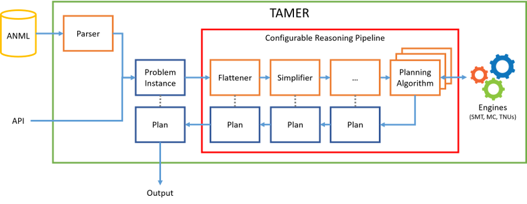

Architecture and Basic Concepts
===============================

Overview
--------

This page introduces the architecture and functionality of the TAMER
Planner. The main goal of TAMER is to build an extensible architecture
for planning.

From a code point-of-view all the code is encapsulated in the "tamer"
namespace.

Architecture
------------

The general plan generation data-flow architecture of TAMER is shown
above. The planning problem ([Problem Instance](@ref tamer::model::ProblemInstanceImpl))
is provided by means of the API or the ANML
parser. A Problem instance is a representation of a problem that
matches 1:1 with an ANML problem. This instance can be transformed and
simplified before being fed to a planning algorithm using a
configurable pipeline of [Problem Transformers](@ref tamer::model::BasicTransformer).

Environment
-----------

The TAMER code is designed to be reentrant and thread-safe, hence all
the global-state information about a run are stored in the
[Environment](@ref tamer::Environment) class.

Currently, this class only contains the
[manager of expressions](@ref tamer::model::ExpressionFactory),
but in the future all the configurations,
the stored plans and the internal state will be saved in the
environment class.

Since many classes are dependent on the global environment, an
[EnvObject](@ref tamer::EnvObject) class mix-in is available: each
class needing to store a reference to the global environment can
inherit the mix-in calling the relative constructor. This
automatically gives the child class an
[environment](@ref tamer::EnvObject::environment) getter member.

The ANML Model Architecture
---------------------------

ANML is a powerful and well-structured modeling language for
expressing temporal planning domains. TAMER includes a set of classes
that model ANML constructs in memory and allow for the manipulation of
ANML models.

All the modeling classes are in the `tamer::model` package.

### Problem Instances

The [ProblemInstance](@ref tamer::model::ProblemInstanceImpl) class represents a single
planning problem instance complete of domain and problem information.

The [ProblemInstance](@ref tamer::model::ProblemInstanceImpl) class inherits from
[TypeScope](@ref tamer::model::TypeScope) and [ExpressionScope](@ref tamer::model::ExpressionScope).
The latter represents a container of
fluents, types, actions and expressions in ANML. In this view, user
types and actions are also scopes.

### The Typing System

All the types in the model derive from the [TypeBase](@ref tamer::model::TypeBase)
class.

#### Primitive Types

ANML and TAMER admit 3 refinable primitive types:

* *Boolean*: usual true/false type, supported via the [BooleanType Class](@ref tamer::model::BooleanTypeBase)
* *Integer*: integer number in \f$ \mathbb{Z} \f$, supported via the [IntegerType Class](@ref tamer::model::IntegerTypeBase)
* *Rational*: rational number in \f$ \mathbb{Q} \f$ (ANML uses the keyword `float` for rationals), supported via the [RationalType Class](@ref tamer::model::RationalTypeBase)

Numeric types (Integers and Reals) can be constrained using upper
and/or lower bounds, this correspond to the ANML types
`integer[minimum, maximum]` and `float[minimum, maximum]`.

#### User Types

Just like ANML, TAMER allows for the construction of user-defined
types.

A user-defined type is a collection of instances, possibly containing
actions and fluents.

TAMER allows to model these constructs using the [UserType](@ref tamer::model::UserTypeImpl)
class that is a [TypeScope](@ref tamer::model::TypeScope) and also a
[TypeBase](@ref tamer::model::TypeBase). Just like [problem instances](@ref tamer::model::ProblemInstanceImpl),
[UserTypes](@ref tamer::model::UserTypeImpl) can contain fluents, actions and expressions.

### Expressions

Expressions are used in Tamer to represent conditions and effects.

All expressions in TAMER are memoized and represented in the form of a
DAG. A factory class called
[ExpressionFactory](@ref tamer::model::ExpressionFactory) is provided for the construction of
expressions.

Expressions are represented as DAGs of n-ary [nodes](@ref tamer::Node) having a
[payload](@ref tamer::model::ExpressionPayload) that identifies the operator.

#### Expression Walkers

In order to navigate and manipulate expression a generic walking class is provided:
[ExpressionWalker](@ref tamer::model::ExpressionWalker).
An instance of [ExpressionWalker](@ref tamer::model::ExpressionWalker) traverses the structure of a given expression possibly computing a value for each node that can be returned.

Several walkers are currently implemented within TAMER:
* [Expressionidentity](@ref tamer::model::ExpressionIdentity) that reconstructs a given expression
* [ExpressionSubstituter](@ref tamer::model::ExpressionSubstituter) that performs logical substitution on a given expression
* [NameResolverExpressionSubstituter](@ref tamer::NameResolverExpressionSubstituter) that is internally used by the parser to resolve fluent names

### Current Limitations

Currently, TAMER *does not support* the following ANML features:

* Type inheritance
* String types
* Set types and uncertainty
* Existential and universal quantifications in expressions
* Conditional effects
* HTN features

We plan to fully support all these features in the future and the
internal structures are designed to support these features.

Parsing
-------

We have a Flex lexer and a Bison parser for the ANML language that
support a fragment of the ANML language and produce a
[problem instance](@ref tamer::model::ProblemInstanceImpl) in output.

The ANML parsing functions are accessible by instantiating and using
the [AnmlParser](@ref tamer::AnmlParser) class.

Problem Transformation
----------------------

Before passing a [problem instance](@ref tamer::model::ProblemInstanceImpl) to a
solving algorithm, TAMER uses a pipeline of problem transformers to
transform and simplify the problem itself.

All the rewriters must inherit the [BasicTransformer](@ref tamer::model::BasicTransformer) class.

Depending on the actual transformation, it may be needed to store
map-back information in the transformer for reporting the artefacts
produced by algorithms, such as plans, at the level of the input
problem. For this reason, transformers behave like functors that can
have state.

Plans and Planning Algorithms
-----------------------------

All the planning algorithms must inherit the [Planner](@ref tamer::Planner)
interface that define a way to generically call a planner.

The interface prescribes the creation of a generic [Plan](@ref tamer::Plan)
object and a identifying name.

*Future Work:* we foresee the creation of a PlannerFactory class to
select the best applicable algorithm from a portfolio of
implementations.
